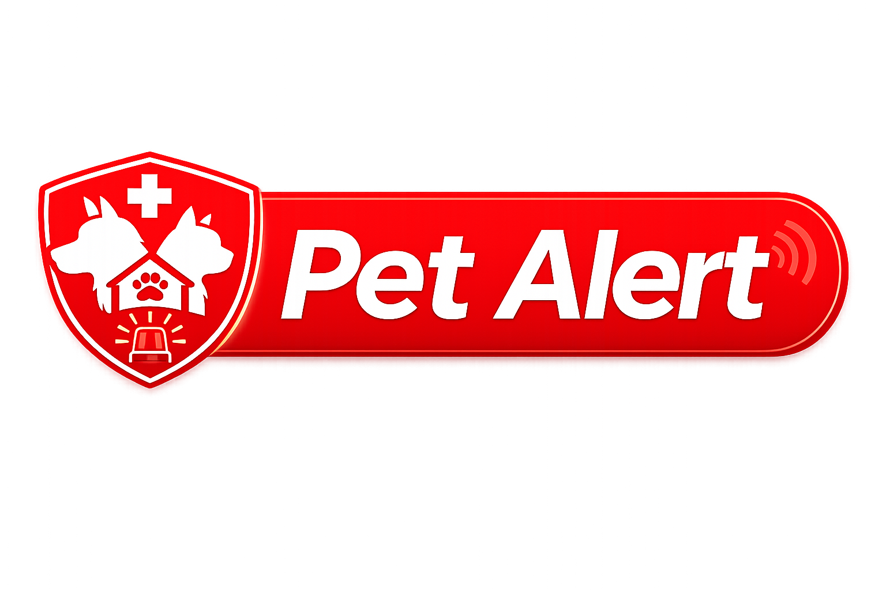
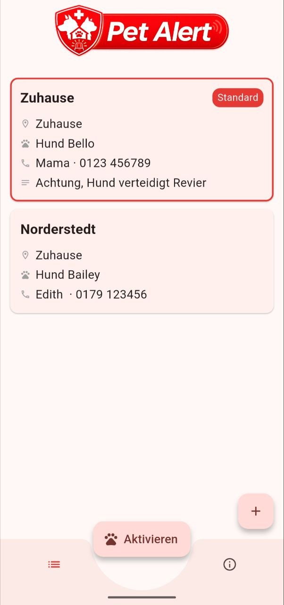

# PetAlert 🐾

PetAlert is an Android app for pet owners that ensures someone checks on their pet at home in case of an emergency.

## Preview

## Idea

If you're involved in an accident or otherwise unable to return home, first responders or hospital staff often have no way of knowing that a pet is waiting alone. PetAlert displays a persistent notification on the lock screen that directly informs first responders and provides an emergency contact.

## Features

- Persistent lock screen notification
- Multiple profiles (e.g. "At home", "At Peter's place")
- One profile can be marked as default
- Multiple pets per profile
- Optional emergency contact per profile
- Free text field for additional notes (e.g. "Dog guards its territory")
- Local data storage via Hive for data privacy
- Enable/disable via in-app button

## Tech Stack

- Flutter (Android)
- flutter_foreground_task – persistent background service
- flutter_local_notifications – lock screen notification
- Hive CE – local data persistence
- Provider – state management

## Status

Early development stage. Android only for now.

## Planned

- Direct call button in the notification
- Improved UI/design
- Additional features:
  - Incognito mode
  - Color themes
  - Language support
